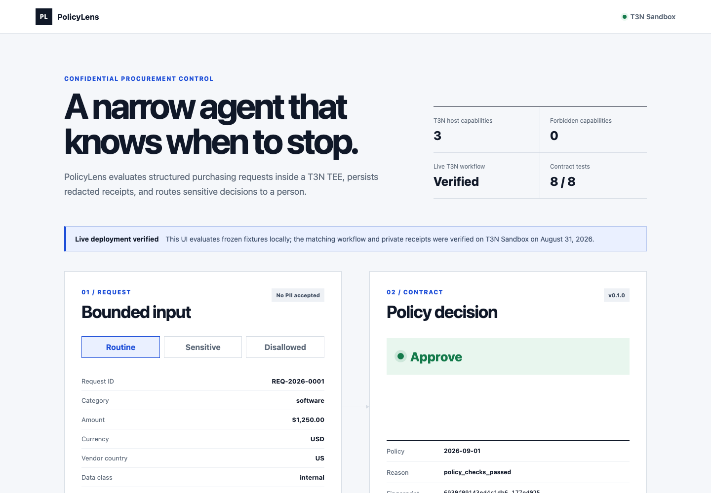

# PolicyLens

PolicyLens is a minimum-authority T3N agent for confidential procurement control. It evaluates a deliberately small, PII-free request schema against a tenant-owned policy inside a Rust/WASI contract, returns `approve`, `human_review`, or `deny`, and persists an idempotent audit receipt in private tenant storage.



## What is live

The contract, two private maps, organization agent, and exact three-function grant are deployed on T3N Sandbox. A signed-manifest developer session completed the live acceptance workflow on August 31, 2026.

| Check | Result |
| --- | --- |
| Contract functions | `evaluate-request`, `get-decision`, `health` |
| T3N host capabilities | tenant context, private KV, redacted logging |
| Forbidden T3N capabilities | 0 — no HTTP, signing, profile, or secret access |
| Rust contract tests | 8 passed |
| TypeScript tests | 9 passed |
| WASM component | 191,635 bytes, SHA-256 `a42c02e75aef1997de969d58e62686ed44b0489f33e2cd57f5da63742eaead8f` |
| Live policy outcomes | approve, replay, collision rejection, deny, PII pre-transport rejection, human review, stored receipt match |

Credential-free live evidence is in [`docs/evidence/live-verification.json`](docs/evidence/live-verification.json). Raw DIDs, API keys, and receipts are intentionally excluded from Git.

The public judging brief is available as a [view-only Google Doc](https://docs.google.com/document/d/1S0gOOoByEzVA0h1LIM7_5tNhnDqqq7cjDyaYIQnw0-w/edit?usp=sharing).

## Why this agent is narrow

Procurement assistants are dangerous when they accept unbounded documents or can act on payment systems. PolicyLens accepts only eight structured fields. Names, email addresses, bank data, tax identifiers, credentials, attachments, and arbitrary text are rejected before transport. The contract cannot call the network. High-value or sensitive requests stop at `human_review`; the agent never purchases anything.

```text
bounded request
      │
      ▼
strict local schema ──rejects──▶ undeclared/PII fields
      │
      ▼
T3N Rust/WASI contract
      ├── reads versioned policy from private KV
      ├── writes idempotent receipt to private KV
      └── returns approve / human_review / deny
```

## Verify locally

Prerequisites: Node.js 22, `rustup`, the stable Rust toolchain with `wasm32-wasip2`, and `wasm-tools`.

```bash
rustup target add wasm32-wasip2 --toolchain stable
./scripts/verify.sh
```

The script uses the `rustup` toolchain's own `cargo`, `rustc`, and dynamic-library directory. This avoids a reproducible macOS failure where Homebrew's `rustc` is selected from `PATH` even though `cargo` came from `rustup`, causing a false “target may not be installed” error.

To inspect the dependency-free UI:

```bash
python3 -m http.server 4175 --directory demo
open http://127.0.0.1:4175
```

The browser UI is an explicitly labelled local preview. Live execution evidence comes from the T3N sandbox receipt, not from the screen animation.

## Operate on T3N Sandbox

1. Claim a developer DID and credits through the official T3N Agent Developer Kit flow.
2. Store the developer key and DID in separate mode-0600 files. Never place key material in `.env`, argv, logs, Git, or a shared document.
3. Copy `.env.example` to a private location and set file paths only.
4. Run `npm ci --prefix agent`, then `npm run quickstart --prefix agent` to verify signed-manifest authentication and DID continuity.
5. For a fresh tenant only, follow [`RUNBOOK.md`](RUNBOOK.md) to register the contract, create private maps, provision the agent, and apply the exact grant.

Fixture request IDs become durable audit keys. Do not rerun first-write acceptance against production data; use unique IDs in a disposable sandbox or retrieve existing receipts.

## Repository map

- `contract/` — Rust policy engine, WIT world, and T3N component
- `agent/` — strict TypeScript clients, provisioning scripts, and acceptance checks
- `fixtures/` — versioned policy and bounded test cases
- `demo/` — static, accessible decision preview
- `docs/` — architecture, public evidence, platform bugs, and submission walkthrough
- `RUNBOOK.md` — deployment, rotation, revocation, recovery, and handover

## Documented platform boundary

T3N's separately issued agent API key currently authenticates and receives the intended grant, but its new agent account has zero credits while `/api/invoke` enforces a 10,000-credit minimum. The public SDK exposes no user-to-agent credit-transfer method. PolicyLens therefore uses the funded developer session for the verified live workflow and preserves the stateless agent-key failure as a reproducible platform issue. See [`docs/BUGS.md`](docs/BUGS.md).

## Handover

The code, build hash, schemas, deployment sequence, revocation procedure, and public evidence are ready for full Terminal 3 handover. Credentials are not part of the repository; they must be rotated or transferred through a separately approved secure channel.

MIT licensed. See [`SECURITY.md`](SECURITY.md) before operating outside a disposable sandbox.
